# 04.1 SAP Cloud Transport Management (cTMS) — Full Configuration Guide

**Scenario:** Two BTP Trial Global Accounts. Global Account A (Source) has **two subaccounts** — a dedicated Central Services subaccount for cTMS, and a DEV subaccount for Integration Suite. Global Account B (Target) has one PROD subaccount with Integration Suite. This reflects the SAP best practice architecture.

---

## Architecture — Best Practice (3 Subaccounts across 2 Global Accounts)

```
Global Account A (Source)                    Global Account B (Target)
│                                            │
├── Subaccount: Central Services             └── Subaccount: PROD
│   ├── Cloud Transport Management               ├── Integration Suite (CPI)
│   │   (subscription + service instance)        ├── Content Agent Service
│   └── Destination: CAS_on_target               └── Process Integration Runtime
│       (points to CAS in PROD subaccount)
│
└── Subaccount: DEV
    ├── Integration Suite (CPI)
    ├── Content Agent Service
    ├── Process Integration Runtime
    └── Destinations:
        ├── ContentAssemblyService → DEV CAS
        ├── CloudIntegration → DEV PIRuntime
        └── TransportManagementService → cTMS in Central Services
```

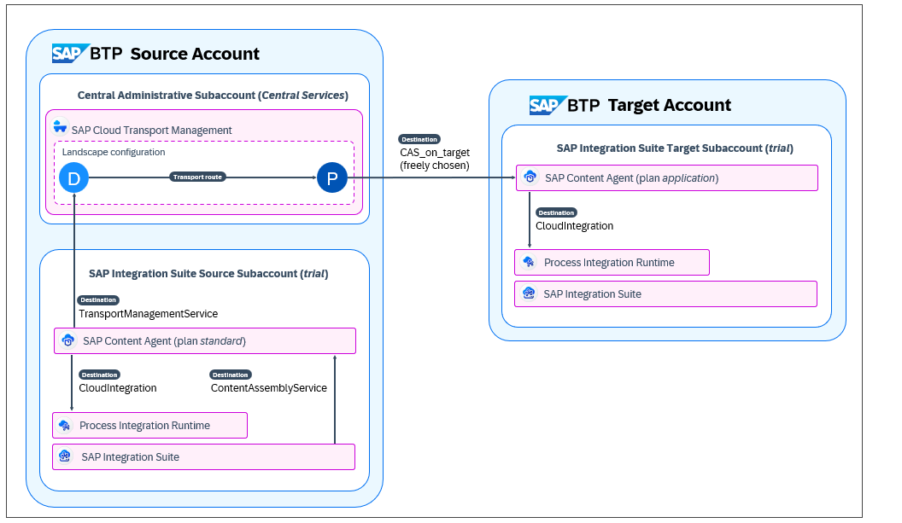


**Source Global Account**


**Destination Global Account**

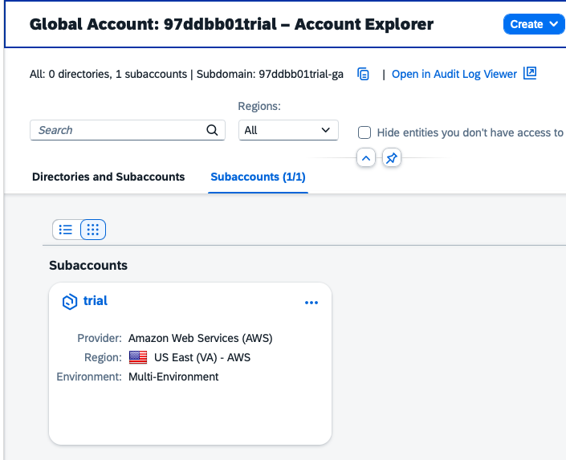

> **Why Central Services is a dedicated subaccount:** cTMS manages the entire transport landscape (DEV node, PROD node, routes). It should not "belong" to the DEV environment. Separating it means: (1) the DEV subaccount can be torn down and rebuilt without destroying the transport infrastructure; (2) transport operators get access to cTMS independently from who has DEV subaccount access; (3) cTMS can serve multiple application subaccounts in future without being tied to any one of them.

> **Cross-Global-Account:** The steps are technically identical to the official SAP tutorial (which uses two subaccounts within the same global account). OAuth2 API calls are HTTPS — they cross global account boundaries without any special configuration. Constraints: (1) all subaccounts must be in the **same CF region** (e.g., all `us10`); (2) an admin of Global Account B must perform the PROD-side steps.

---

## End-to-End Flow

```
Developer clicks Transport on a CPI package (DEV subaccount)
  → CPI calls CAS (DEV) via ContentAssemblyService destination
  → CAS (DEV) assembles the package into an MTAR archive
  → CAS (DEV) calls cTMS API via TransportManagementService destination
  → cTMS (Central Services) places TR in DEV_Node queue → auto-forwards to PROD_Node queue
  → Transport Admin opens cTMS UI (Central Services), imports from PROD_Node queue
  → cTMS calls CAS (PROD) via CAS_on_target destination (OAuth2, cross-global-account)
  → CAS (PROD) deploys the MTAR into PROD CPI via its local CloudIntegration destination
  → Package appears in PROD CPI tenant (undeployed — iFlows must be deployed manually)
```

---

## Authentication & Authorization — Full Explanation

### OAuth 2.0 Client Credentials Flow (Machine-to-Machine)

Every service-to-service call in this setup uses **OAuth 2.0 Client Credentials Grant**. There is no human login involved:

1. The calling service (e.g., CAS) sends its **Client ID + Client Secret** to the **XSUAA token endpoint** (`/oauth/token`).
2. XSUAA validates the credentials and returns a short-lived **JWT Bearer Token**.
3. The calling service includes this JWT in `Authorization: Bearer <token>` when calling the target API.
4. The target service validates the JWT (issuer, expiry, scopes) before processing the request.

BTP Destinations of type `OAuth2ClientCredentials` automate steps 1–3. You configure the credentials once; BTP handles the token exchange at runtime.

### What a Service Key Contains

When you create a **Service Instance**, BTP provisions that service and registers an OAuth client with XSUAA. When you create a **Service Key**, XSUAA generates a Client ID + Secret bound to that instance:

```json
{
  "uri": "https://<service-api-endpoint>",      ← use this for the Destination URL
  "url": "https://<service-api-endpoint>",      ← some services use "url" instead of "uri"
  "uaa": {
    "clientid":     "sb-<uuid>!b<number>",
    "clientsecret": "<secret>",
    "url":          "https://<subdomain>.authentication.<region>.hana.ondemand.com",
    "tokenurl":     "https://<subdomain>.authentication.<region>.hana.ondemand.com/oauth/token"
  }
}
```

> ⚠️ **cTMS service key specifically uses `uri`** (not `url`) for the service API endpoint. Scroll to the **bottom** of the cTMS service key JSON to find `uri`. Using the top-level `url` points to XSUAA, not cTMS.

### XSUAA Role Collections for cTMS

Two role collections are **pre-delivered** (exist after subscription, just assign users). Two must be **created manually** and populated via the subscription Roles tab.

| Role Collection | Pre-delivered? | Who gets it | What it allows |
|---|---|---|---|
| `TMS_LandscapeOperator_RC` | ✅ Yes | Basis/Admin | Create/edit nodes, routes, destinations |
| `TMS_Viewer_RC` | ✅ Yes | Audit/read-only | View landscape and import queues |
| `TMS_Administrator_RC` | ❌ Create manually | Overall admin | All permissions combined |
| `TMS_TransportOperator_RC` | ❌ Create manually | Dev/Ops team | Trigger imports; can be restricted to specific nodes via attributes |

The `TransportOperator` role template supports **node-level attributes** — you can restrict an operator to only `DEV_Node` (developers) or only `PROD_Node` (ops team), enforcing separation of duties. See Step 5c for details.

CPI-side roles (assigned in DEV subaccount):
- `AuthGroup.Administrator` → unlocks `Settings → Integrations → Transport` in CPI
- `WorkspacePackagesTransport` → shows the Transport button on packages in CPI Design

### Why 401 on Connection Test is Normal

BTP destination connection tests only check network reachability — they do not perform an OAuth token exchange. The request arrives at the service without a valid Bearer token, correctly returning `401`. Ignore 401 on all connection tests in this guide. Validate instead via **Check Configuration** in the CPI Settings page.

### Why You Must Log Out After Role Assignment

XSUAA JWTs are stateless and self-contained — new role scopes are only included in a token generated at your next login. After assigning any role collection, log out and log back in before testing.

---

## Step-by-Step Configuration

### Overview

| Step | Task | Subaccount |
|---|---|---|
| 1 | Create Central Services subaccount | Global Account A |
| 2 | Assign entitlements | Global Account A |
| 3 | Subscribe to cTMS Application (UI) | Central Services |
| 4 | Create cTMS service instance + service key | Central Services |
| 5 | Set up cTMS role collections (pre-delivered + custom + node attributes) | Central Services |
| 6 | Subscribe to Integration Suite; assign CPI roles | DEV |
| 7 | Create CAS instance + service key | DEV |
| 8 | Create PIRuntime instance + service key | DEV |
| 9 | Create `ContentAssemblyService` destination | DEV |
| 10 | Create `CloudIntegration` destination | DEV |
| 11 | Subscribe to Integration Suite; assign CPI roles | PROD (Global Account B) |
| 12 | Create CAS instance + service key | PROD |
| 13 | Create PIRuntime instance + service key | PROD |
| 14 | Create `CloudIntegration` destination | PROD |
| 15 | Create `CAS_on_target` deployment destination | Central Services |
| 16 | Configure transport nodes + route in cTMS UI | Central Services (cTMS UI) |
| 17 | Create `TransportManagementService` destination | DEV |
| 18 | Assign `WorkspacePackagesTransport` role collection | DEV |
| 19 | Enable transport mode in CPI | DEV CPI tenant |
| 20 | Run test transport end-to-end | DEV CPI → cTMS UI → PROD CPI |

---

## Global Account A — Part 1: Central Services Subaccount

### Step 1: Create the Central Services Subaccount

Navigate to: **Global Account A → Account Explorer → Create → Subaccount**

| Field | Value |
|---|---|
| Display Name | `Central Services` |
| Region | **Same region as your DEV and PROD subaccounts** (e.g., `US East (VA) — us10`) |
| Subdomain | e.g., `central-services-<yourID>` |

Click **Create**. Then enable Cloud Foundry for this subaccount and create a CF space (e.g., `ctms-space`).

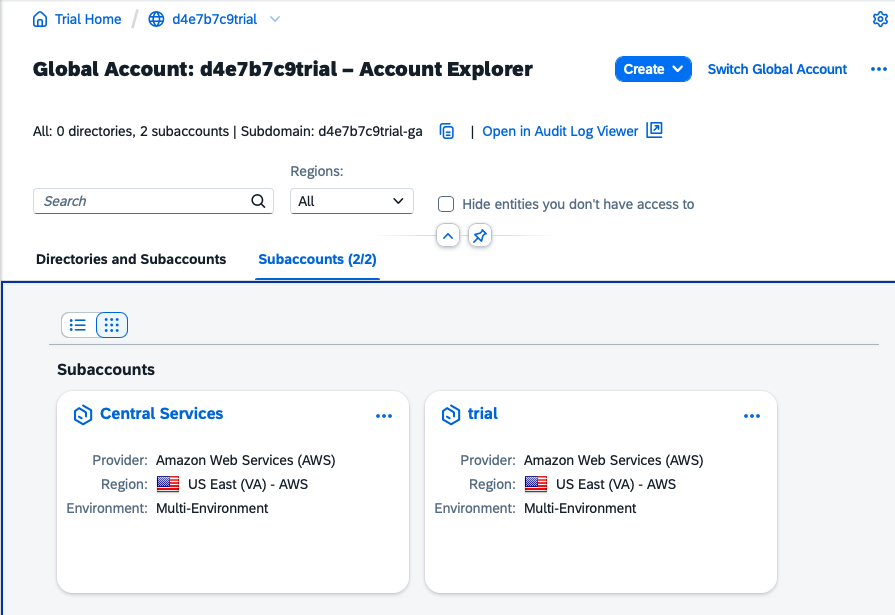

> **Region must match across all three subaccounts.** Cross-region transport is not supported. If DEV is `us10`, Central Services and PROD must also be `us10`.

---

### Step 2: Assign Entitlements

Navigate to: **Global Account A → Entitlements → Entity Assignments**

**Central Services subaccount:**

| Service                    | Plan               | Type    |
| -------------------------- | ------------------ | ------- |
| Cloud Transport Management | standard           | Service |
| Cloud Transport Management | lite (Application) | Service |

**DEV subaccount:**

| Service | Plan | Type | Purpose |
|---|---|---|---|
| Integration Suite | trial | Application | CPI tenant (already done) |
| Content Agent Service | standard | Service | Assembles and exports MTAR |
| Process Integration Runtime | api | Service | CPI transport API access |

**PROD subaccount (Global Account B):**

| Service | Plan | Type | Purpose |
|---|---|---|---|
| Integration Suite | trial | Application | CPI tenant |
| Content Agent Service | standard | Service | Deploys MTAR into PROD CPI |
| Process Integration Runtime | api | Service | CPI deployment API access |

**Why two plans for cTMS?**
The **Application** plan provides the Fiori UI for landscape management and import queue operations. The **Standard** plan provides the API endpoint (`uri` in the service key) that CAS calls to push transport requests programmatically. Both are required — the UI for humans, the service instance for machine-to-machine communication.

---

### Step 3: Subscribe to cTMS Application (Central Services)

Navigate to: **Central Services Subaccount → Services → Service Marketplace → Cloud Transport Management**

1. Click **Create**.
2. Plan: **lite (Application)**.
3. Click **Create** and wait for status: `Subscribed`.

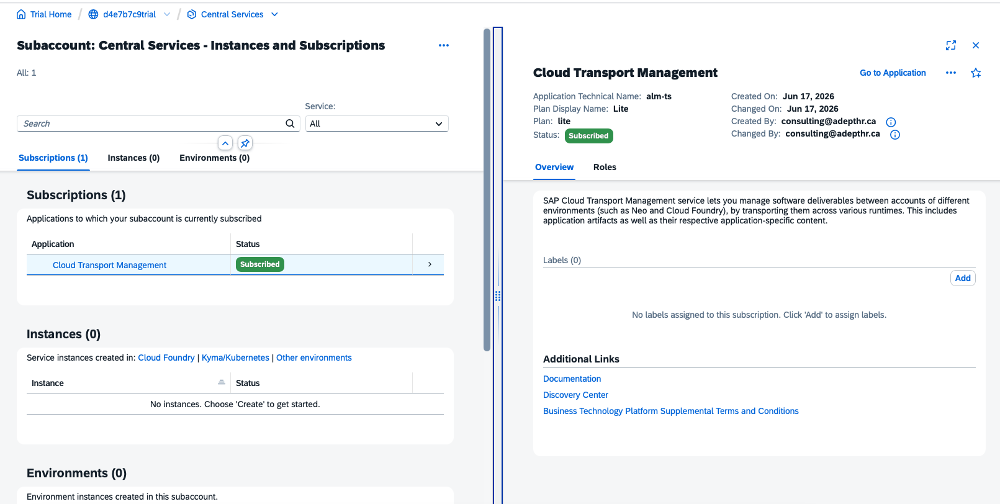


Access the cTMS UI: **Services → Instances and Subscriptions → Cloud Transport Management → Go to Application link**.

---

### Step 4: Create cTMS Service Instance + Service Key (Central Services)

First make sure that the cloud foundry is activated
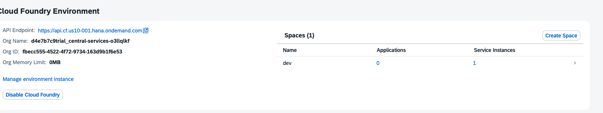

Navigate to: **Central Services Subaccount → Services → Service Marketplace → Cloud Transport Management**

1. Click **Create**.
2. Plan: **standard** (service instance).
3. Instance name: e.g., `cTMS-instance`.
4. Click **Create**.

Create service key: navigate to the instance → three dots → **Create Service Key**
- Key name: `cTMS-service-key`

Open the key and note these values — used later in Step 17:

```
uri              → cTMS API base URL  ⚠️ scroll to BOTTOM of JSON — use "uri", NOT "url"
uaa.clientid     → OAuth Client ID
uaa.clientsecret → OAuth Client Secret
uaa.url          → XSUAA base URL (Token Service URL = uaa.url + /oauth/token)
```
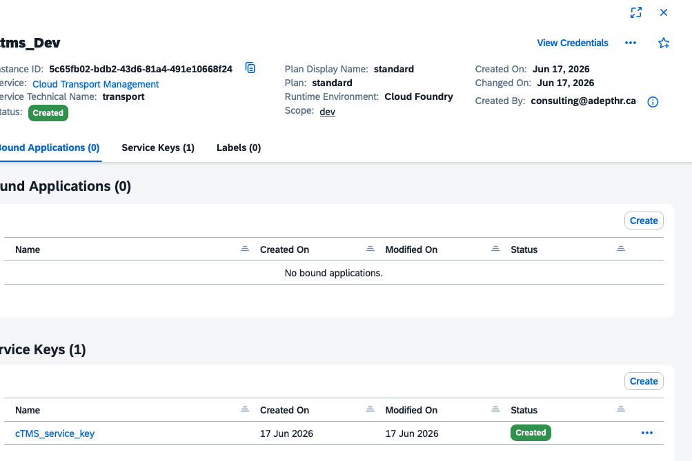

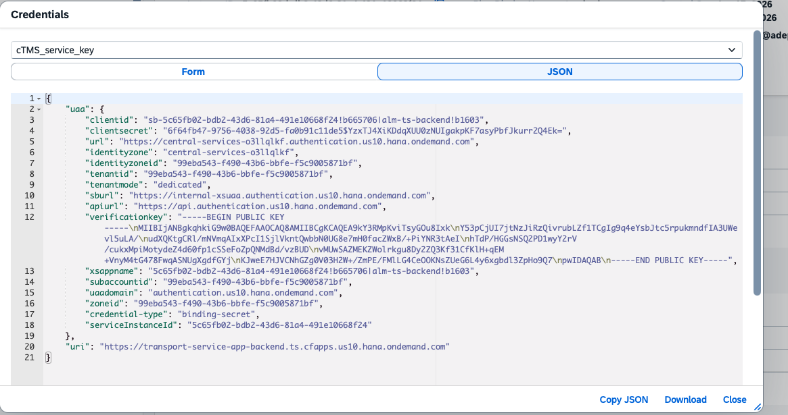

```

{
  "uri": "https://transport-service-app-backend.ts.cfapps.us10.hana.ondemand.com",
  "uaa": {
    "tenantmode": "dedicated",
    "sburl": "https://internal-xsuaa.authentication.us10.hana.ondemand.com",
    "subaccountid": "99eba543-f490-43b6-bbfe-f5c9005871bf",
    "credential-type": "binding-secret",
    "clientid": "sb-5c65fb02-bdb2-43d6-81a4-491e10668f24!b665706|alm-ts-backend!b1603",
    "xsappname": "5c65fb02-bdb2-43d6-81a4-491e10668f24!b665706|alm-ts-backend!b1603",
    "clientsecret": "6f64fb47-9756-4038-92d5-fa0b91c11de5$YzxTJ4XiKDdqXUU0zNUIgakpKF7asyPbfJkurr2Q4Ek=",
    "serviceInstanceId": "5c65fb02-bdb2-43d6-81a4-491e10668f24",
    "url": "https://central-services-o3llqlkf.authentication.us10.hana.ondemand.com",
    "uaadomain": "authentication.us10.hana.ondemand.com",
    "verificationkey": "-----BEGIN PUBLIC KEY-----\nMIIBIjANBgkqhkiG9w0BAQEFAAOCAQ8AMIIBCgKCAQEA9kY3RMpKviTsyGOu8Ixk\nY53pCjUI7jtNzJiRzQivrubLZf1TCgIg9q4eYsbJtc5rpukmndfIA3UWevl5uLA/\nudXQKtgCRl/mNVmqAIxXPcI1SjlVkntQwbbN0UG8e7mH0facZWxB/+PiYNR3tAeI\nhTdP/HGGsNSQ2PD1wyY2rV/cukxMpiMotydeZ4d60fp1cSSeFoZpQNMdBd/vzBUD\nvMUwSAZMEKZWolrkgu8Dy2ZQ3Kf31CfKlH+qEM+VnyM4tG478FwqASNUgXgdfGYj\nKJweE7HJVCNhGZg0V03H2W+/ZmPE/FMlLG4CeOOKNsZUeG6L4y6xgbdl3ZpHo9Q7\npwIDAQAB\n-----END PUBLIC KEY-----",
    "apiurl": "https://api.authentication.us10.hana.ondemand.com",
    "identityzone": "central-services-o3llqlkf",
    "identityzoneid": "99eba543-f490-43b6-bbfe-f5c9005871bf",
    "tenantid": "99eba543-f490-43b6-bbfe-f5c9005871bf",
    "zoneid": "99eba543-f490-43b6-bbfe-f5c9005871bf"
  }
}
```

> **`uri` vs `url`:** The top-level `url` in the cTMS service key points to the XSUAA authentication server — not the cTMS API. The `uri` field at the bottom of the JSON is the actual cTMS service endpoint. Using `url` in the `TransportManagementService` destination causes all CAS export calls to hit XSUAA and fail.

---

### Step 5: Set Up cTMS Role Collections (Central Services)

This step is more involved than a simple assignment. There are **four cTMS role templates**, and they are handled in two different ways.

Create a new Role Collection

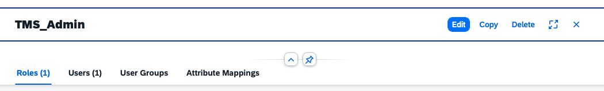

Add this Role Collection to the Roles of the Transport Management Application
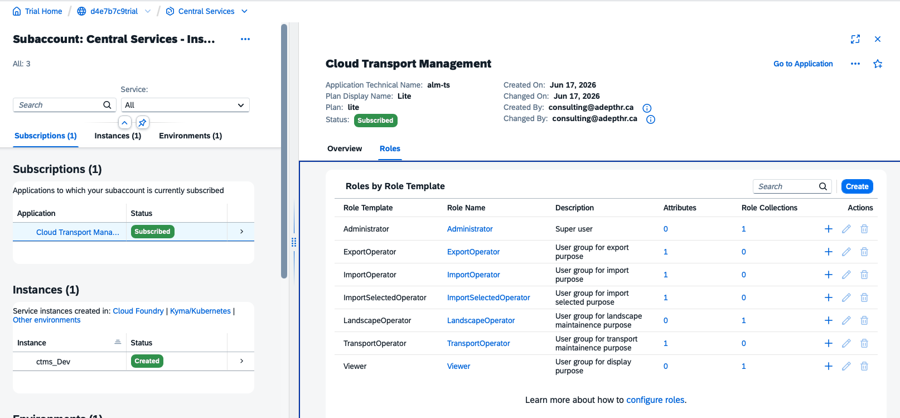

Add the Role Collection to the user

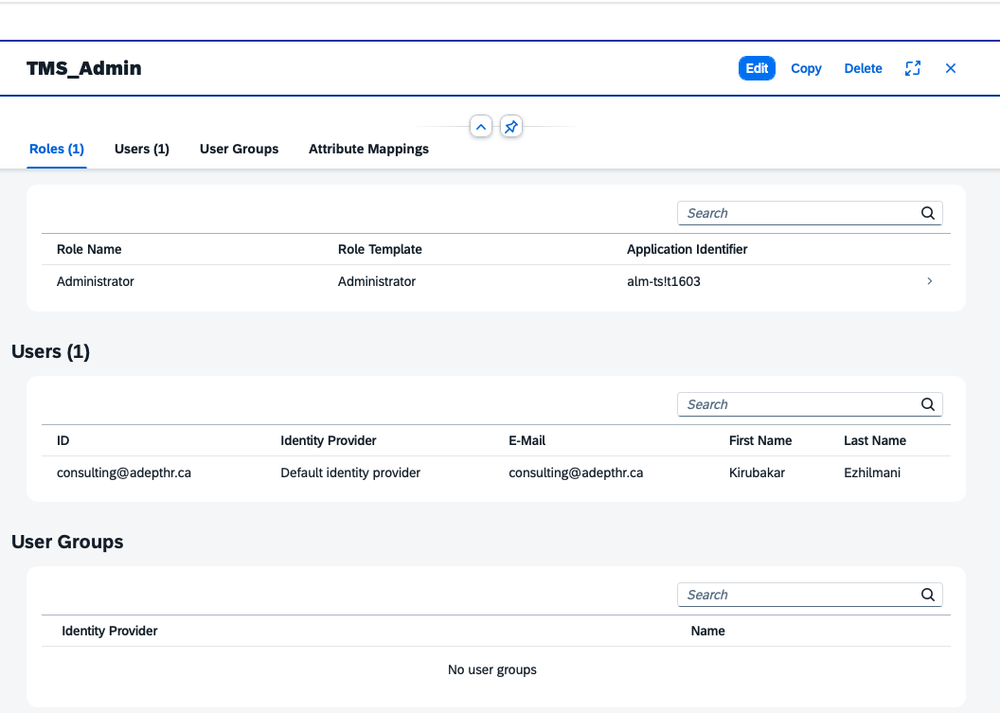

---

## Global Account A — Part 2: DEV Subaccount

### Step 6: Set Up Integration Suite in DEV Subaccount

If not already done — subscribe to Integration Suite, activate the Cloud Integration capability, and assign yourself these role collections:
- `Integration_Provisioner`
- `PI_Administrator`
- `PI_Integration_Developer`
- `PI_Read_Only`

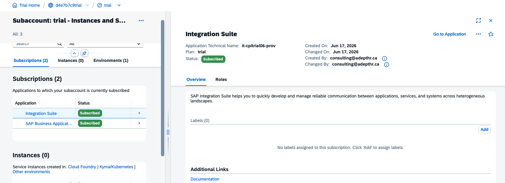


---

### Step 7: Create CAS Instance + Service Key (DEV)

Navigate to: **DEV Subaccount → Services → Service Marketplace → Content Agent Service**

1. Plan: **standard** | Instance name: e.g., `cpi-dev`
2. Create service key: e.g., `cas-on-cpi-dev`

Note for Step 9:
```
url              → CAS API base URL
uaa.clientid     → OAuth Client ID
uaa.clientsecret → OAuth Client Secret
uaa.url          → XSUAA base URL (Token URL = uaa.url + /oauth/token)
```
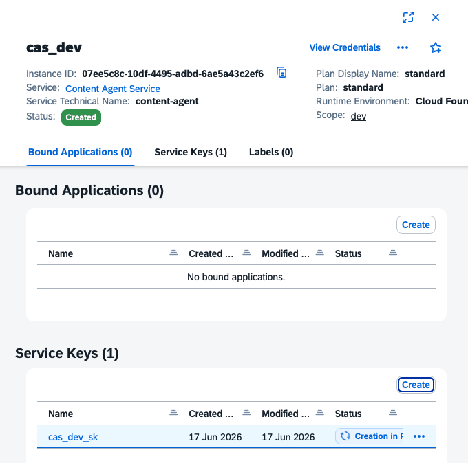


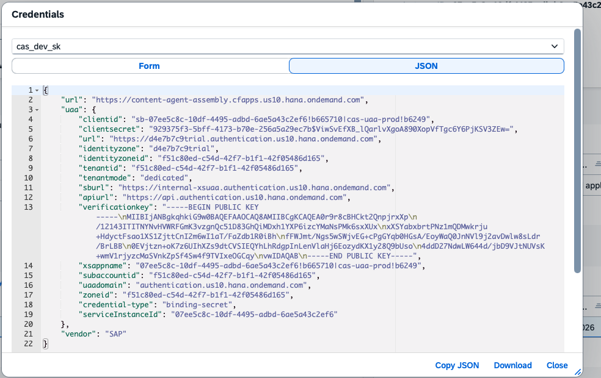

```
{
  "vendor": "SAP",
  "url": "https://content-agent-assembly.cfapps.us10.hana.ondemand.com",
  "uaa": {
    "tenantmode": "dedicated",
    "sburl": "https://internal-xsuaa.authentication.us10.hana.ondemand.com",
    "subaccountid": "f51c80ed-c54d-42f7-b1f1-42f05486d165",
    "credential-type": "binding-secret",
    "clientid": "sb-07ee5c8c-10df-4495-adbd-6ae5a43c2ef6!b665710|cas-uaa-prod!b6249",
    "xsappname": "07ee5c8c-10df-4495-adbd-6ae5a43c2ef6!b665710|cas-uaa-prod!b6249",
    "clientsecret": "929375f3-5bff-4173-b70e-256a5a29ec7b$ViwSvEfXB_lQarlvXgoA890XopVfTgc6Y6PjKSV3ZEw=",
    "serviceInstanceId": "07ee5c8c-10df-4495-adbd-6ae5a43c2ef6",
    "url": "https://d4e7b7c9trial.authentication.us10.hana.ondemand.com",
    "uaadomain": "authentication.us10.hana.ondemand.com",
    "verificationkey": "-----BEGIN PUBLIC KEY-----\nMIIBIjANBgkqhkiG9w0BAQEFAAOCAQ8AMIIBCgKCAQEA0r9r8cBHCkt2QnpjrxXp\n/12143ITITNYNvHVWRFGmK3vzgnQc51D83GhQiMDxh1YXP6izcYMaNsPMk6sxXUx\nxXSYabxbrtPNz1mQDMwkrju+HdyctFsao1XS1ZjttCnI2m6wI1aT/FaZdb1R0iBh\nfFWJmt/Ngs5wSWjvEG+cPgGYqb0HGsA/EoyWaQ0JnNVl9j2avDwlw8sLdr/BrLBB\n0EVjtzn+oK7z6UIhXZs9dtCVSIEQYhLhRdgpInLenVlaHj6EozydKX1y28Q9bUso\n4ddD27NdwLW644d/jbD9VJtNUVsK+wmV1rjyzcMaSVnkZpSf4Sw4f9TVIxeOGCqy\nvwIDAQAB\n-----END PUBLIC KEY-----",
    "apiurl": "https://api.authentication.us10.hana.ondemand.com",
    "identityzone": "d4e7b7c9trial",
    "identityzoneid": "f51c80ed-c54d-42f7-b1f1-42f05486d165",
    "tenantid": "f51c80ed-c54d-42f7-b1f1-42f05486d165",
    "zoneid": "f51c80ed-c54d-42f7-b1f1-42f05486d165"
  }
}
```


---

### Step 8: Create PIRuntime Instance + Service Key (DEV)

Navigate to: **DEV Subaccount → Services → Service Marketplace → Process Integration Runtime**

1. Plan: **api** | Instance name: e.g., `pi-dev`
2. In the JSON configuration, provide **all three roles**:

```json
{
  "roles": [
    "WorkspacePackagesTransport",
    "WorkspacePackagesRead",
    "WorkspacePackagesEdit"
  ]
}
```

3. Create service key: e.g., `pi-on-cpi-dev`

Note for Step 10:
```
url              → CPI tenant base URL
uaa.clientid     → OAuth Client ID
uaa.clientsecret → OAuth Client Secret
uaa.tokenurl     → Full token URL (already includes /oauth/token for PIRuntime keys)
```

**Why three roles?**
- `WorkspacePackagesTransport` — permits the transport API call
- `WorkspacePackagesRead` — permits CAS to read package content for MTAR assembly
- `WorkspacePackagesEdit` — permits CAS to update transport metadata during export

All three scopes are embedded in every JWT token issued to this OAuth client. Missing any one causes a `403 Forbidden` on the specific API call that requires it. If the instance was created with fewer roles, you must **recreate it** (JSON config cannot be updated after creation).


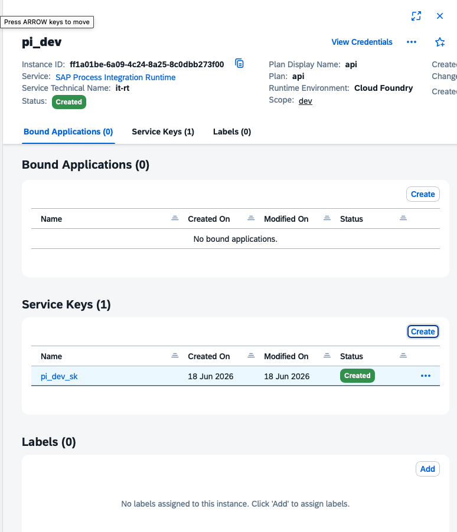


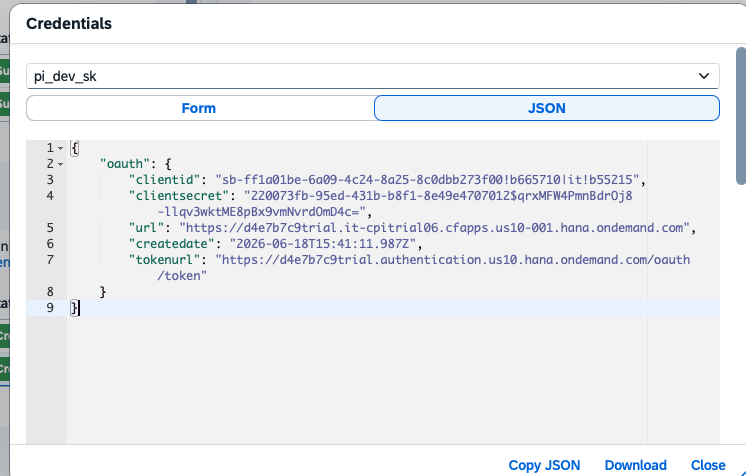

```
{
  "oauth": {
    "createdate": "2026-06-18T15:41:11.987Z",
    "clientid": "sb-ff1a01be-6a09-4c24-8a25-8c0dbb273f00!b665710|it!b55215",
    "clientsecret": "220073fb-95ed-431b-b8f1-8e49e4707012$qrxMFW4PmnBdrOj8-llqv3wktME8pBx9vmNvrdOmD4c=",
    "tokenurl": "https://d4e7b7c9trial.authentication.us10.hana.ondemand.com/oauth/token",
    "url": "https://d4e7b7c9trial.it-cpitrial06.cfapps.us10-001.hana.ondemand.com"
  }
}
```

---

### Step 9: Create `ContentAssemblyService` Destination (DEV)

Navigate to: **DEV Subaccount → Connectivity → Destinations → Create**

Choose **Service Instance** method (not "From Scratch") — this auto-populates all OAuth fields from the service key, eliminating manual copy errors.

- Select instance: `cpi-dev` (your DEV CAS instance)
- Select service key: `cas-on-cpi-dev`
- Click **Next → Next**

In the Destination Details step:

| Field            | Value                                                        |
| ---------------- | ------------------------------------------------------------ |
| **Name**         | `ContentAssemblyService` (**exact case — hardcoded in CPI**) |
| Description      | Destination to SAP Content Agent (DEV)                       |
| All other fields | Auto-populated from service key — leave unchanged            |

Click **Create**.

**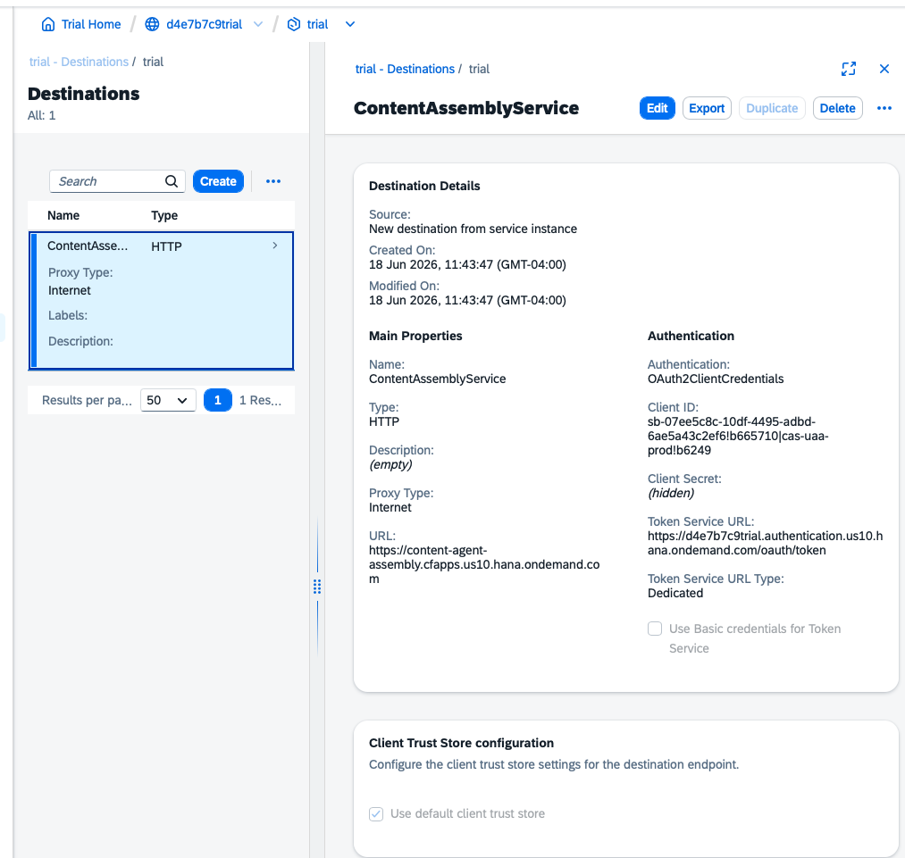
**

**Why this exact name?** CPI's transport module looks up a BTP destination named exactly `ContentAssemblyService` in its own subaccount at runtime. A single character difference (including casing) causes CPI to fail with "destination not found" when the developer clicks Transport.

---

### Step 10: Create `CloudIntegration` Destination (DEV)

Navigate to: **DEV Subaccount → Connectivity → Destinations → Create → From Scratch**

> Must be created from scratch — the URL requires manual construction (base URL + API path not in the service key).

| Field             | Value                                                                       |
| ----------------- | --------------------------------------------------------------------------- |
| **Name**          | `CloudIntegration` (**exact case — hardcoded in CAS**)                      |
| Description       | Destination to SAP Cloud Integration (DEV)                                  |
| URL               | `url` from DEV PIRuntime service key + `/api/1.0/transportmodule/Transport` |
| Proxy Type        | Internet                                                                    |
| Authentication    | `OAuth2ClientCredentials`                                                   |
| Client ID         | `uaa.clientid` from DEV PIRuntime service key                               |
| Client Secret     | `uaa.clientsecret` from DEV PIRuntime service key                           |
| Token Service URL | `uaa.tokenurl` from DEV PIRuntime service key                               |

Click **Create**.

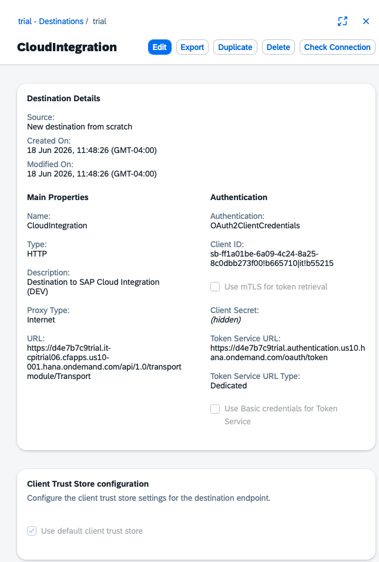


**Why append `/api/1.0/transportmodule/Transport`?** The service key `url` gives the CPI tenant root. CAS calls this specific API path on CPI to trigger package assembly into MTAR format. There is no way to infer this path from the service key — it must be constructed manually.

---

## Global Account B — PROD Subaccount

> Someone with admin access to Global Account B performs these steps.

### Step 11: Set Up Integration Suite in PROD Subaccount

Subscribe to Integration Suite (trial plan), activate Cloud Integration, and assign the same role collections as Step 6.

---

### Step 12: Create CAS Instance + Service Key (PROD)

Same steps as Step 7, in the **PROD subaccount**:
- Instance name: e.g., `cpi-prod` | Key name: `cas-on-cpi-prod`

<font color="#ff0000">- **Use the application plan type not the standard type**</font>

Note these values — they are shared with the person configuring Global Account A (needed in Step 15):
```
url              → PROD CAS API base URL
uaa.clientid     → OAuth Client ID
uaa.clientsecret → OAuth Client Secret
uaa.url          → XSUAA base URL (Token URL = uaa.url + /oauth/token)
```


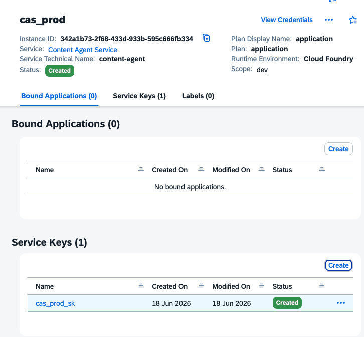


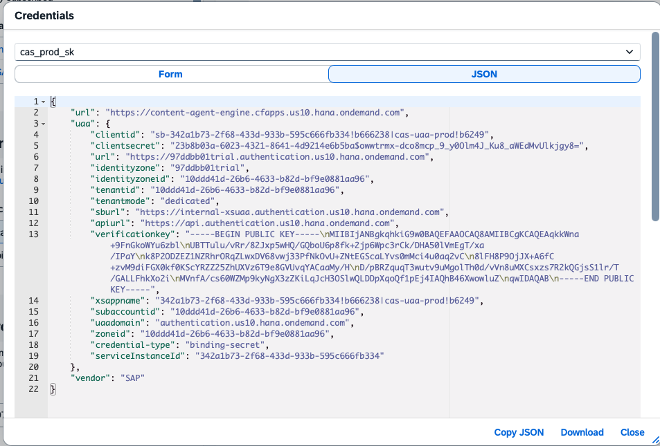

```
{
  "vendor": "SAP",
  "url": "https://content-agent-engine.cfapps.us10.hana.ondemand.com",
  "uaa": {
    "tenantmode": "dedicated",
    "sburl": "https://internal-xsuaa.authentication.us10.hana.ondemand.com",
    "subaccountid": "10ddd41d-26b6-4633-b82d-bf9e0881aa96",
    "credential-type": "binding-secret",
    "clientid": "sb-342a1b73-2f68-433d-933b-595c666fb334!b666238|cas-uaa-prod!b6249",
    "xsappname": "342a1b73-2f68-433d-933b-595c666fb334!b666238|cas-uaa-prod!b6249",
    "clientsecret": "23b8b03a-6023-4321-8641-4d9214e6b5ba$owwtrmx-dco8mcp_9_y0Olm4J_Ku8_aWEdMvUlkjgy8=",
    "serviceInstanceId": "342a1b73-2f68-433d-933b-595c666fb334",
    "url": "https://97ddbb01trial.authentication.us10.hana.ondemand.com",
    "uaadomain": "authentication.us10.hana.ondemand.com",
    "verificationkey": "-----BEGIN PUBLIC KEY-----\nMIIBIjANBgkqhkiG9w0BAQEFAAOCAQ8AMIIBCgKCAQEAqkkWna+9FnGkoWYu6zbl\nUBTTulu/vRr/82Jxp5wHQ/GQboU6p8fk+2jp6Wpc3rCk/DHA50lVmEgT/xa/IPaY\nk8P2ODZEZ1NZRhrORqZLwxDV68vwj33PfNkOvU+ZNtEGScaLYvs0mMci4u0aq2vC\n8lFH8P9OjJX+A6fC+zvM9diFGX0kf0KScYRZZ25ZhUXVz6T9e8GVUvqYACaaMy/H\nD/pBRZquqT3wutv9uMgolTh0d/vVn8uMXCsxzs7R2kQGjsS1lr/T/GALLFhkXo2i\nMVnfA/cs60WZMp9kyNgX3zZKiLqJcH3OSlwQLDDpXqoQf1pEj4IAQhB46XwowluZ\nqwIDAQAB\n-----END PUBLIC KEY-----",
    "apiurl": "https://api.authentication.us10.hana.ondemand.com",
    "identityzone": "97ddbb01trial",
    "identityzoneid": "10ddd41d-26b6-4633-b82d-bf9e0881aa96",
    "tenantid": "10ddd41d-26b6-4633-b82d-bf9e0881aa96",
    "zoneid": "10ddd41d-26b6-4633-b82d-bf9e0881aa96"
  }
}
```


**Why does the target need CAS?** cTMS does not deploy into the target CPI directly. It hands off the MTAR to CAS on the target via OAuth2 (`CAS_on_target` destination). CAS on target then performs the deployment using its own local `CloudIntegration` destination. This keeps deployment logic on the target side and uses OAuth2 throughout — no CF technical user with SpaceDeveloper access is required.

---

### Step 13: Create PIRuntime Instance + Service Key (PROD)

Same steps as Step 8, in the **PROD subaccount**:
- Instance name: e.g., `pi-prod` | Key name: `pi-on-cpi-prod`
- Same JSON with all three roles


{
  "oauth": {
    "createdate": "2026-06-18T15:50:02.050Z",
    "clientid": "sb-0121125f-b07a-4860-98c9-15711e473b6d!b666238|it!b55215",
    "clientsecret": "88a0430d-cdd9-44f9-bbe7-08d10792b63c$imRFXSTnFhbI0MzqQ5htf_KeYf7pLvyBaNymvHCKtoc=",
    "tokenurl": "https://97ddbb01trial.authentication.us10.hana.ondemand.com/oauth/token",
    "url": "https://97ddbb01trial.it-cpitrial06.cfapps.us10-001.hana.ondemand.com"
  }
}


---

### Step 14: Create `CloudIntegration` Destination (PROD)

Same steps as Step 10, in the **PROD subaccount**, using PROD PIRuntime service key values:

| Field | Value |
|---|---|
| **Name** | `CloudIntegration` (same fixed name) |
| URL | `url` from PROD PIRuntime service key + `/api/1.0/transportmodule/Transport` |
| Client ID | `uaa.clientid` from PROD PIRuntime service key |
| Client Secret | `uaa.clientsecret` from PROD PIRuntime service key |
| Token Service URL | `uaa.tokenurl` from PROD PIRuntime service key |

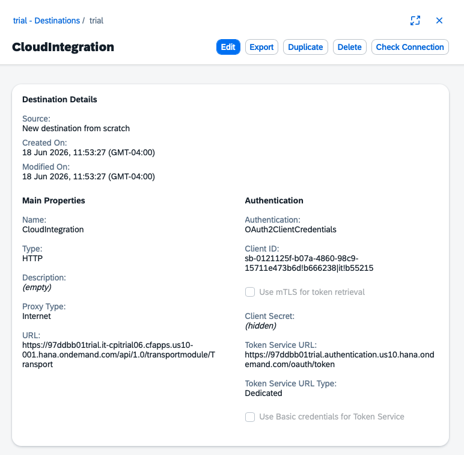

**Why does the target also need this destination?** When CAS on target receives the MTAR from cTMS, it needs to know where the PROD CPI tenant is to deploy it. CAS looks up its own `CloudIntegration` destination locally. Without it, the import step fails when CAS attempts the deployment call.

---

## Global Account A — Part 3: Connect Landscape in Central Services

### Step 15: Create `CAS_on_target` Deployment Destination (Central Services)

Navigate to: **Central Services Subaccount → Connectivity → Destinations → Create → From Scratch**

Use the **PROD CAS service key values** from Step 12:

| Field             | Value                                                                                           |
| ----------------- | ----------------------------------------------------------------------------------------------- |
| Name              | `CAS_on_target` (not a fixed name — you reference it when configuring the PROD node in Step 16) |
| Description       | Content Agent on PROD (Global Account B)                                                        |
| URL               | `url` from PROD CAS service key                                                                 |
| Proxy Type        | Internet                                                                                        |
| Authentication    | `OAuth2ClientCredentials`                                                                       |
| Client ID         | `uaa.clientid` from PROD CAS service key                                                        |
| Client Secret     | `uaa.clientsecret` from PROD CAS service key                                                    |
| Token Service URL | `uaa.url` from PROD CAS service key + `/oauth/token`                                            |

Click **Create**.

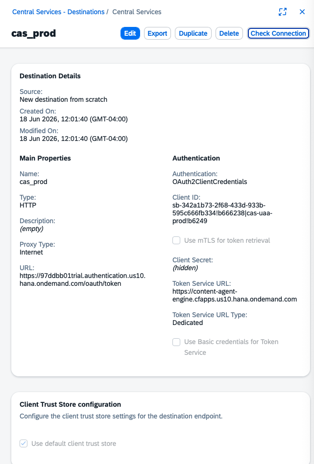


**What does this destination do?** When the transport admin imports a TR from the PROD_Node queue, cTMS calls this destination to deliver the MTAR to CAS in Global Account B. This OAuth2 call crosses the global account boundary — which works because it is simply an HTTPS API call to the CAS service URL in Global Account B. No special cross-account configuration is needed.

**Why is this destination in Central Services (not DEV)?** Because cTMS lives in Central Services. The deployment destination is used by cTMS at import time to call the target endpoint — so it must exist in the same subaccount as cTMS.

---

### Step 16: Configure Transport Nodes and Route (cTMS UI)

Open the **cTMS UI**: Central Services → Services → Instances and Subscriptions → Cloud Transport Management → Go to Application.

Navigate to **Landscape Visualization**.

**Create the Source Node (DEV_Node):**

Click **+** (Create a Node):

| Field | Value | Notes |
|---|---|---|
| Name | `DEV_Node` | Must exactly match the `sourceSystemId` value you set in Step 17 |
| Description | SAP Integration Suite — DEV (Global Account A) | |
| **Allow Upload to Node** | **Checked** | Permits CAS (source) to push transport requests into this node's queue. Without this, the upload API call is rejected. |
| Content Type | Leave blank | Source nodes do not deploy — they only receive uploads and forward |
| Destination | Leave blank | Only target nodes need a deployment destination |

Click **OK**.

**Create the Target Node (PROD_Node):**

Click **+** (Create a Node):

| Field | Value | Notes |
|---|---|---|
| Name | `PROD_Node` | |
| Description | SAP Integration Suite — PROD (Global Account B) | |
| Allow Upload to Node | Leave unchecked | Pure target node |
| **Content Type** | **Multi-Target Application** | Integration Suite packages are transported as MTAR archives |
| **Destination** | **`CAS_on_target`** | Created in Step 15 — points to CAS on the PROD subaccount |

Click **OK**.

**Why Content Type = Multi-Target Application?** This tells cTMS the format of the archives it will receive and how to route them for deployment. MTAR is the archive format used by CF-based services including Integration Suite.

**Create the Transport Route:**

Click the connector icon → Create Route:

| Field | Value |
|---|---|
| Name | `DEV_to_PROD` |
| Description | Route from DEV to PROD |
| Source Node | `DEV_Node` |
| Target Node | `PROD_Node` |

Click **OK**.

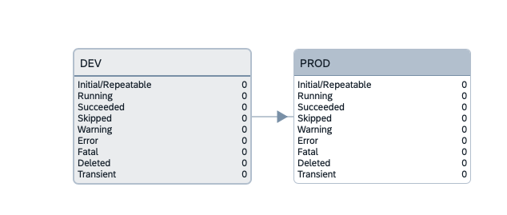


**What does the route do?** When CAS uploads an MTAR to `DEV_Node`'s queue, cTMS automatically forwards it to `PROD_Node`'s import queue via this route. The import itself is triggered manually by the transport admin — the route defines the direction, not the timing.

---

### Step 17: Create `TransportManagementService` Destination (DEV Subaccount)

> Note: this destination is created in the **DEV subaccount** (where CAS lives), using credentials from the **cTMS service key** in Central Services.

Navigate to: **DEV Subaccount → Connectivity → Destinations → Create → From Scratch**

| Field | Value |
|---|---|
| **Name** | `TransportManagementService` (**exact case — hardcoded in CAS**) |
| Description | Destination to SAP Cloud Transport Management |
| URL | **`uri`** from cTMS service key (Central Services, Step 4) — scroll to **bottom** of key JSON |
| Proxy Type | Internet |
| Authentication | `OAuth2ClientCredentials` |
| Client ID | `uaa.clientid` from cTMS service key |
| Client Secret | `uaa.clientsecret` from cTMS service key |
| Token Service URL | `uaa.url` from cTMS service key + `/oauth/token` |
| **Additional Property** | Key: `sourceSystemId` / Value: `DEV_Node` |

Click **Create**.

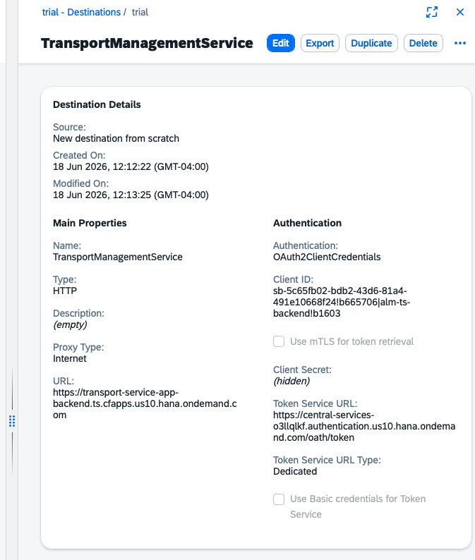

**What is `sourceSystemId`?** When CAS calls the TMS API to upload a transport request, TMS must know which node the upload belongs to so it can route it downstream via the configured route. This value must exactly match the Name field of the source transport node in cTMS (`DEV_Node` from Step 16). A mismatch causes TMS to reject the upload with an unrecognized source system error.

**Why is this destination in DEV, even though cTMS is in Central Services?** CAS (in DEV) is the service making the API call to cTMS. BTP Destination service looks up destinations in the subaccount of the calling application. So the `TransportManagementService` destination must be in the same subaccount as CAS — the DEV subaccount. The destination points to a service (cTMS) that lives in a different subaccount, which is perfectly valid.

---

## Global Account A — Part 4: Enable Transport and Test

### Step 18: Assign WorkspacePackagesTransport Role (DEV Subaccount)

Navigate to: **DEV Subaccount → Security → Role Collections → Create**
- Name: e.g., `CPI-Transport`

Edit the collection:
1. In the Role Name column, search for and select `WorkspacePackagesTransport`.
2. Add your user email in the Users section.
3. Click **Save**.

Log out and log back in.

---

### Step 19: Enable Transport Mode in CPI (DEV Subaccount)

Open the **DEV CPI tenant** via Integration Suite.

Navigate to: **Settings → Integrations → Transport tab**

> The path is `Settings → Integrations` first, then select the **Transport** tab within that page. The Edit and Save buttons are at the **bottom-right corner** of the page — easy to miss.

1. Click **Edit** (bottom-right).
2. Change dropdown from (no selection) to **Transport Management Service**.
3. Click **Save** (bottom-right).

Click **Check Configuration**. Expected result:
```
✓ ContentAssemblyService      → SUCCESS
✓ CloudIntegration            → SUCCESS
✓ TransportManagementService  → SUCCESS (DEV_Node reachable in Central Services cTMS)
```

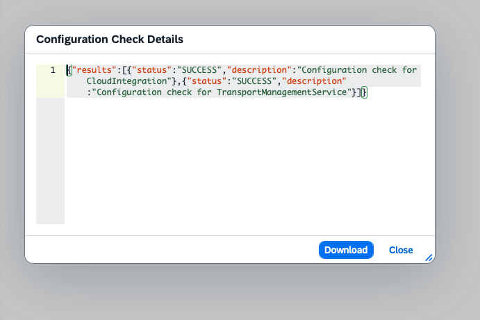

If any check fails — error messages identify the specific destination issue. Common causes: wrong destination name casing, wrong field from service key (`url` vs `uri` for TMS), PIRuntime instance missing required roles.

---

### Step 20: Run a Test Transport

**In the DEV CPI tenant:**

1. Go to **Discover → Integrations** → find any standard SAP package → click **Copy** to add it to your Design section.
2. Go to **Design → Integrations and APIs** → open the copied package.
3. Click **Transport** (top-right — only visible if `WorkspacePackagesTransport` role is assigned).
4. Enter a comment (e.g., *Test transport 01*), optionally check *Propagate logged-in user as transport owner*.
5. Click **Transport**. A Transport Request (TR) number is returned.

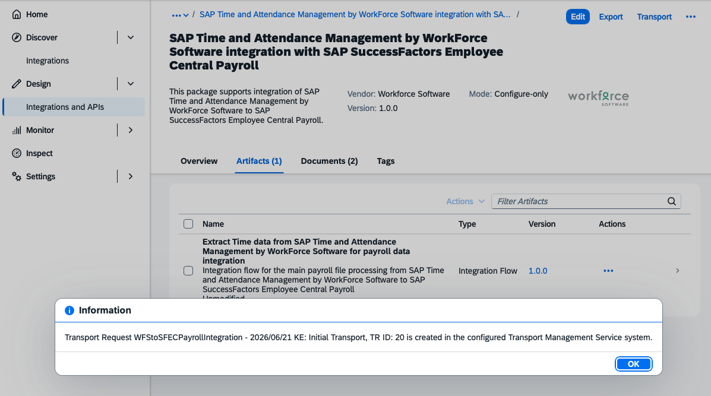


**In the cTMS UI (Central Services subaccount):**

1. Home screen shows a pending count on `PROD_Node`. Click it to open the import queue.

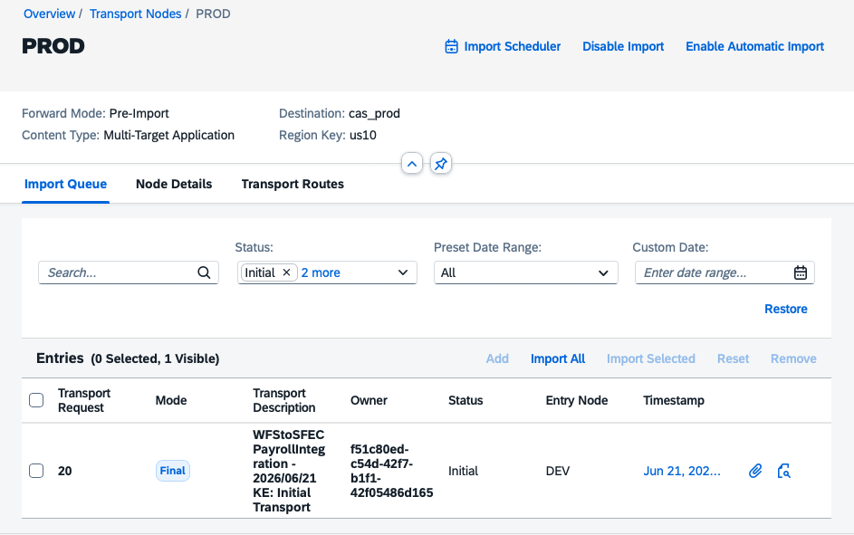

2. Select the Transport Request. Verify Transport Description (package name) and Owner (your email).
3. Click **Import All** → confirm with **OK**.

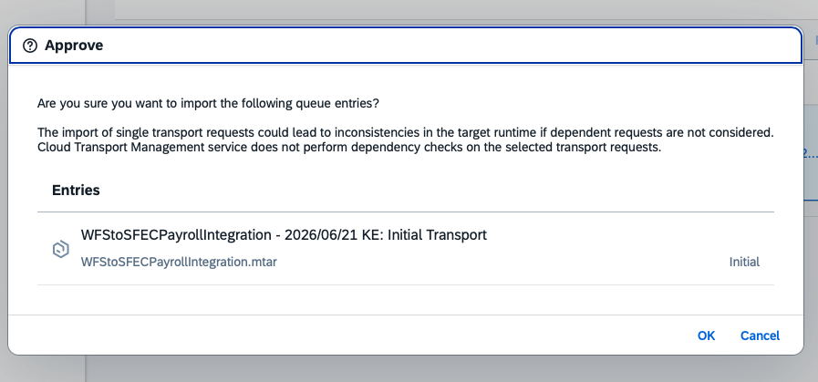

4. Status changes to `Succeeded`. Click the log icon to see detailed import steps.

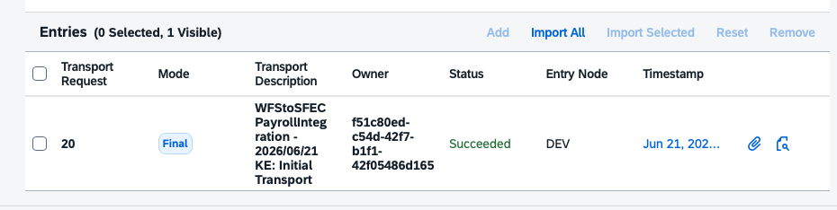

**In the PROD CPI tenant:**

Go to **Design → Integrations and APIs**. The transported package appears. The creator shown will be the Client ID of the PROD CAS service key — confirming automated OAuth2 deployment by CAS (not a manual import). Artifacts arrive **undeployed** — deploy iFlows manually in the PROD tenant.

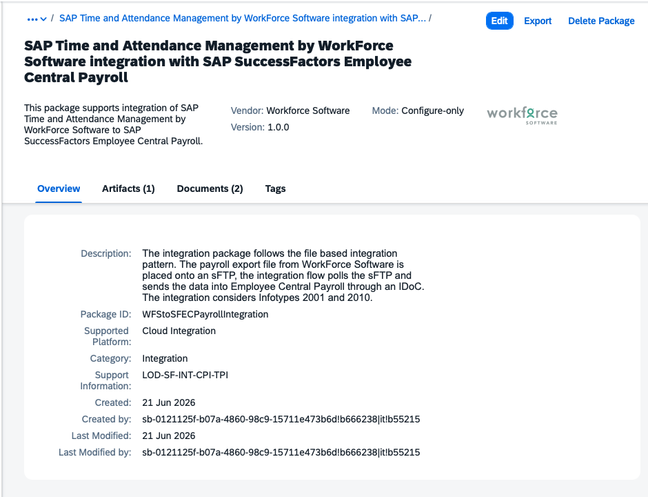

---

## Appendix A — Service Key → Destination Mapping

| Destination | Subaccount | Service Key Source | URL Field | Token URL |
|---|---|---|---|---|
| `ContentAssemblyService` | DEV | DEV CAS service key | `url` | `uaa.url` + `/oauth/token` |
| `CloudIntegration` | DEV | DEV PIRuntime service key | `url` + `/api/1.0/transportmodule/Transport` | `uaa.tokenurl` |
| `TransportManagementService` | DEV | **Central Services** cTMS service key | **`uri`** (bottom of JSON) | `uaa.url` + `/oauth/token` |
| `CAS_on_target` | **Central Services** | **PROD** CAS service key | `url` | `uaa.url` + `/oauth/token` |
| `CloudIntegration` | **PROD** | PROD PIRuntime service key | `url` + `/api/1.0/transportmodule/Transport` | `uaa.tokenurl` |

---

## Appendix B — Common Errors and Root Causes

| Error | Root Cause | Fix |
|---|---|---|
| `ContentAssemblyService not found` | Destination name casing wrong | Must be exactly `ContentAssemblyService` |
| `TransportManagementService fails` | Used `url` instead of `uri` from cTMS key | Edit destination; use `uri` at bottom of cTMS service key JSON |
| `sourceSystemId not recognized` | Additional property doesn't match node name | Must be exactly `DEV_Node` (matches Step 16 node name) |
| `Configuration check fails for CloudIntegration` | PIRuntime instance missing roles | Recreate instance with all 3 roles in JSON config |
| `Import fails — deployment error` | `CloudIntegration` missing in PROD subaccount | Create `CloudIntegration` destination in PROD using PROD PIRuntime key |
| `Import fails — CAS auth error` | `CAS_on_target` has wrong key values | Verify PROD CAS service key is used, not DEV CAS key |
| `Transport button not visible in CPI` | `WorkspacePackagesTransport` role not assigned | Create role collection, assign role + user, log out and back in |
| `Check Configuration does not show Transport tab` | Settings path wrong | Path: `Settings → Integrations → Transport tab` (not `Settings → Transport`) |
| `FileStorage / region error on import` | Subaccounts in different CF regions | All three subaccounts must be in the same CF region (e.g., all `us10`) |
| `401 on connection test` | Expected — test doesn't send a Bearer token | Ignore; validate via Check Configuration in CPI |

1. Error during deployment initialization: Failed to get a JWT token from UAA

	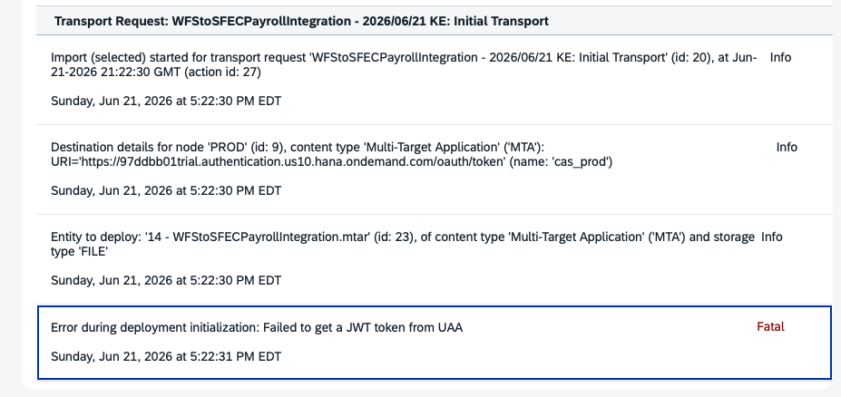


---

## Appendix C — Architecture Diagram

```
┌──────────────────────────────────────────────────────────────────────────┐
│  Global Account A (Source)                                                │
│                                                                            │
│  ┌──────────────────────────────────────────┐                             │
│  │  Central Services Subaccount              │                             │
│  │  ┌────────────────────────────────────┐  │                             │
│  │  │  cTMS                              │  │                             │
│  │  │  ├─ DEV_Node (Allow Upload = true)  │  │                             │
│  │  │  ├─ PROD_Node (→ CAS_on_target)    │  │                             │
│  │  │  └─ Route: DEV_Node → PROD_Node    │  │                             │
│  │  └────────────────────────────────────┘  │                             │
│  │  Destination: CAS_on_target (OAuth2) ─────────────────────────┐       │
│  └──────────────────────────────────────────┘                     │       │
│                                                                    │       │
│  ┌──────────────────────────────────────────┐                     │       │
│  │  DEV Subaccount                           │                     │       │
│  │  ┌──────────┐  ContentAssemblyService     │                     │       │
│  │  │  CPI     │──────────────────────────→  │                     │       │
│  │  │  Tenant  │     ┌──────────────────┐    │                     │       │
│  │  └──────────┘     │  CAS (DEV)       │    │                     │       │
│  │                   └────────┬─────────┘    │                     │       │
│  │  CloudIntegration ↑        │ TransportMgmtService               │       │
│  │  (PIRuntime)               ↓              │                     │       │
│  │                   cTMS API (Central Svcs) │                     │       │
│  └──────────────────────────────────────────┘                     │       │
└──────────────────────────────────────────────────────────────────────────┘
                                                                     │
                                              OAuth2 (cross-GA HTTPS)│
                                                                     ↓
┌──────────────────────────────────────────────────────────────────────────┐
│  Global Account B (Target)                                                │
│                                                                            │
│  ┌──────────────────────────────────────────┐                             │
│  │  PROD Subaccount                          │                             │
│  │  ┌──────────────────┐  CloudIntegration  │                             │
│  │  │  CAS (PROD)      │──────────────────→ │                             │
│  │  └──────────────────┘  ┌──────────────┐  │                             │
│  │                        │  CPI Tenant  │  │                             │
│  │                        │  (PROD)      │  │                             │
│  │                        └──────────────┘  │                             │
│  └──────────────────────────────────────────┘                             │
└──────────────────────────────────────────────────────────────────────────┘
```

---

## References

**Official SAP Developers Tutorial Series (April 2025 — Primary Reference)**
- [Transport SAP Integration Suite Content — Scenario Overview | SAP Developers](https://developers.sap.com/tutorials/btp-transport-management-cpi-01-use-case.html)
- [Set Up the SAP Integration Suite Source Subaccount | SAP Developers](https://developers.sap.com/tutorials/btp-transport-management-cpi-02-set-up-source-account.html)
- [Set Up the SAP Integration Suite Target Subaccount | SAP Developers](https://developers.sap.com/tutorials/btp-transport-management-cpi-03-set-up-target-account.html)
- [Create Transport Destination and Configure Landscape | SAP Developers](https://developers.sap.com/tutorials/btp-transport-management-cpi-04-connect-source-and-target.html)
- [Establish Export Connection to cTMS | SAP Developers](https://developers.sap.com/tutorials/btp-transport-management-cpi-05-create-ctms-destination.html)
- [Enable the Transport in SAP Integration Suite | SAP Developers](https://developers.sap.com/tutorials/btp-transport-management-cpi-06-enable-the-transport.html)
- [Run a Test Transport | SAP Developers](https://developers.sap.com/tutorials/btp-transport-management-cpi-07-test-transport.html)
- [Get Started with SAP Cloud Transport Management | SAP Developers](https://developers.sap.com/tutorials/btp-transport-management-getting-started.html)

**SAP Help Portal**
- [What Is SAP Cloud Transport Management | SAP Help Portal](https://help.sap.com/docs/cloud-transport-management/sap-cloud-transport-management/what-is-sap-cloud-transport-management)
- [Setting Up Role Collections for cTMS | SAP Help Portal](https://help.sap.com/docs/cloud-transport-management/sap-cloud-transport-management/setting-up-role-collections)
- [Create SAP Cloud Integration Destination | SAP Help Portal](https://help.sap.com/docs/content-agent-service/user-guide/create-sap-cloud-integration-destination)
- [OAuth Client Credentials Authentication | SAP Help Portal](https://help.sap.com/docs/connectivity/sap-btp-connectivity-cf/oauth-client-credentials-authentication)

**SAP Community & Blogs**
- [Transport CPI Content with TMS and Content Agent Service | SAP Blogs](https://blogs.sap.com/2022/03/25/transport-sap-cloud-integration-ci-cpi-content-with-transport-management-service-tms-and-content-agent-service-cas/)
- [Step By Step Configuring CTMS Setup in BTP | SAP Community](https://community.sap.com/t5/technology-blog-posts-by-members/step-by-step-configuring-ctms-setup-in-btp/ba-p/14119106)
- [SAP Cloud Transport Management DevOps FAQ | SAP Community](https://pages.community.sap.com/topics/devops/cloud-transport-management-faq)
- [Handling Delivery with Transports — SAP Learning Journey](https://learning.sap.com/learning-journeys/discovering-devops-with-sap-btp/handling-delivery-with-transports_d9fe865e-4d83-44d7-acf5-2195bfd43fe5)
